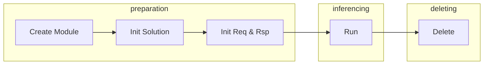

# 调用文档

- 索引

    - [简介](#简介)

    - [依赖](#依赖)

    - [SDK文件目录树](#SDK文件目录树)

    - [调用流程](#调用流程)

    - [示例](#示例)

---

## 简介

本文档为ViMo串联SDK调用文档，内容包括ViMo SDK使用方法（如初始化、运行等），以及对应场景的调用方法。

- 如果您在环境配置上有困难，请参考`requirements.md`配置文档。
- 如果您在调用过程中遇到了问题，请参考`FAQ.md`常见问题文档。
- 如果您想了解更多ViMo SDK相关接口的描述、方法定义及参数说明等内容，请参考：
  - C++ 接口文档：`API.md`
  - C 接口文档：`C_API.md`
  - C# 接口文档：`CSharp_API.md`

---

## 依赖

Windows与Linux依赖版本相同，详细信息请参考SDK中的`requirements.md`文档。

依赖包括：

- OpenCV 4.2.0
- ONNXRuntime 1.7.0

- CUDA 11.0（GPU版）

- cuDNN 8.0 for CUDA 11.0（GPU版）

**注意**：

1. OpenCV、ONNXRuntime 动态库均已打包在 SDK 压缩包中，除此之外，SDK 需要依赖 CUDA 11.0 版本和对应的 cuDNN 8.0 版本。
2. 调用时，需要确保 SDK 内打包好的动态库可以被可执行文件链接到。为此，Windows 可以直接将动态库放入可执行文件同级目录下；Linux 可以选择设置`LD_LIBRARY_PATH`。

---

## 调用流程



ViMo SDK调用流程分为三个阶段：准备阶段、推理阶段、销毁阶段。

- 准备阶段：创建SDK模组实例，对SDK模型进行初始化，初始化请求体与响应体。

- 推理阶段：SDK根据输入的请求体与响应体进行推理，将最终结果存入响应体中。

- 销毁阶段：销毁SDK申请的资源。


### 准备阶段

准备阶段中包含创建模组、初始化解决方案、初始化请求体与响应体三个步骤，其目的是为推理结果做数据准备。

#### 创建模组

本步骤创建SDK模组示例，模组示例由C++中的`std::shared_ptr`托管，在程序结束后自动销毁。

- C++ 示例：

```c++
// create module
std::shared_ptr<smartmore::series::ISeriesCallerModule> module =
    smartmore::series::ISeriesCallerModule::Create("C:\\user\\config.json");
```

- C 示例：

```c
c_sdk_create(&sdk, "C:\\user\\config.json");
```

- C# 示例：

```c#
VimoSeries.Create(ref sdk, Encoding.UTF8.GetBytes(@"C:\user\config.json");
```

#### 初始化解决方案

本步骤根据传入的参数，选择模组中需要被初始化的解决方案。

- C++ 示例：

```c++
module->Init(type_name, solution_id,
             true, use_gpu,
             print_prt);
```

- C 示例：

```c
c_sdk_init(&sdk, "图像类别1", 0, true, 0, false);
```

- C# 示例：

```c#
VimoSeries.SDKInit(ref sdk, Encoding.UTF8.GetBytes("图像类别1\0"), 0, true, 0, false);
```

#### 初始化请求体与响应体

本步骤初始化请求体与响应体，分别作为算法推理的入参与出参。

- C++ 示例：

```c++
smartmore::series::SeriesRequest req(req_type, input_path);
smartmore::series::SeriesResponse rsp;
```

- C 示例：

```c
c_req_and_rsp_init(&sdk, &req, &rsp, "C:\\user\\vimo-series-sdk\\alg\\det-seg\\pics\\Top Cam (12).BMP");
```

- C# 示例：

```c#
VimoSeries.ReqRspInit(ref sdk, ref request, ref response, Encoding.UTF8.GetBytes("C:\\user\\vimo-series-sdk\\alg\\det-seg\\pics\\Top Cam (12).BMP"));
```

### 推理阶段

推理阶段中包含推理这一个步骤。

#### 推理

本步骤将准备阶段的数据进行算法推理，最后将结果存入响应体中，可通过打印相关函数或类进行输出，或自行转换为对应算法结果结构体输出（可参考`tutorial/demo.cpp`和接口文档`API.md`）。

- C++ 示例：

```c++
module->Run(req, rsp);
```

- C 示例：

```c
c_sdk_run(&sdk, &req, &rsp);
```

- C# 示例：

```c#
VimoSeries.Run(ref sdk, ref request, ref response);
```

### 销毁阶段

销毁阶段包含销毁这一个步骤。

#### 销毁

本步骤中销毁SDK申请的资源。需要注意的是，C++ 中无需手动调用销毁函数，由析构函数自动销毁。

- C 示例：

```c
c_sdk_delete(&sdk, &req, &rsp);
```

- C# 示例：

```c#
VimoSeries.Delete(ref sdk, ref request, ref response);
```

---

## 调用示例

以下是各语言接口的具体示例，可配合示例代码（C++：`tutorial/demo.cpp`，C#：`csharp_example/Program.cs`）。

### C++ 调用示例

下面是 SDK 构建与调用示例说明（SDK 内的 tutorial 文件夹提供了完整 cmake 与 demo 代码）。由于依赖为64位release版，构建的可执行文件需为64位release版。同时为了保证依赖可以正常链接，Linux可以选择设置LD_LIBRARY_PATH，Windows可以将依赖库放置与可执行文件同级目录。

使用SDK C++接口时，需要将其添加到项目依赖中。我们推荐使用CMake管理项目依赖和构建选项。下面是CMakeLists.txt示例：

```cmake
cmake_minimum_required(VERSION 3.16)

project(demo)

add_executable(demo demo.cpp)

find_package(OpenCV REQUIRED)

target_link_libraries(series_sdk_demo
PRIVATE
    VimoSeries
    ${OpenCV_LIBS}
)

target_include_directories(series_sdk_demo
PRIVATE
    ${OpenCV_DIR}
)
```

在C++中，这些接口被封装在smartmore::series::ISeriesCallerModule类中，调用之前需要通过Create方法实例化对象并返回其指针：

```c++
std::shared_ptr<smartmore::series::ISeriesCallerModule> module =
smartmore::series::ISeriesCallerModule::Create(json_path);
```

1. 首先调用SDK初始化接口进行初始化：

```c++
smartmore::series::ResultCode result_code = module->Init(type, i, use_gpu, device_id);
if (result_code != smartmore::series::ResultCode::kSuccess)
{
    std::cout << "Error: Failed to init sdk module, result code = " << static_cast<int>(result_code) << std::endl;
    system("pause");
    return -1;
}
```

通过返回的状态码可以判断接口执行的结果。

2. 初始化请求体与响应体：

```c++
smartmore::series::SDKType req_type = module->GetFirstType();
smartmore::series::SeriesRequest req(req_type, input_path);
smartmore::series::SeriesResponse rsp;
```

3. 在调用运行接口时传入这两个结构体的引用：

```c++
result_code = module->Run(req, rsp);
```

**注意**：同一个实例中，第一次推理需要初始化CUDA，故花费时间较长。

参考示例如下：

```c++

#include <memory>
#include <iostream>
#include <opencv2/opencv.hpp>
#include "ISeriesCallerModule.h"
#include "assist.h"

int main()
{
    // args
    auto print_prt = std::make_shared<Printer>();
    std::string json_path = R"(C:\user\vimo-series-sdk\config.json)";
    std::string type_name = "seg";
    int solution_id = 0;
    bool use_gpu = false;
    std::string input_path = R"(C:\user\vimo-series-sdk\data\test\test.bmp)";
    // std::string input_path = "/home/user/vimo-sdk/vimo-series-sdk/data/test/";
    
    // create module
    std::shared_ptr<smartmore::series::ISeriesCallerModule> module =
        smartmore::series::ISeriesCallerModule::Create(json_path);
    
    // init solution
    module->Init(type_name, solution_id,
                 true, use_gpu,
                 print_prt);

    // req args
    smartmore::series::SDKType req_type = module->GetFirstType();
    
    // inference image
    
    // init req and rsp
    smartmore::series::SeriesRequest req(req_type, input_path);
    smartmore::series::SeriesResponse rsp;
    std::cout << "img: " << input_path << std::endl;

    // Run
    auto start = std::chrono::high_resolution_clock::now();
    module->Run(req, rsp);
    auto end = std::chrono::high_resolution_clock::now();
    std::cout << "[Demo] Run time: " << std::chrono::duration_cast<std::chrono::milliseconds>(end - start).count() / 1000.0 << "s\n";

    std::cout << "the end" << std::endl;
    
    return 0;
}
```

- 注：详细构建与代码请参考SDK中的tutorial文件夹。

---

### C 调用示例

在C中，这些接口为C++接口的封装，调用之前需要通过Create方法实例化对象指针：

```c++
c_sdk_create(&sdk, "C:\\user\\vimo-series-sdk\\alg\\det-seg\\config.json");
```

1. 首先调用SDK初始化接口进行初始化：

```c++
c_sdk_init(&sdk, "图像类别1", 0, true, 0, false);
```

可以通过返回的状态码可以判断接口执行的结果。即`0`为正常，`1`为失败。

2. 初始化请求体与响应体：

```c++
c_req_and_rsp_init(&sdk, &req, &rsp, "C:\\user\\vimo-series-sdk\\alg\\det-seg\\pics\\Top Cam (12).BMP");
```

3. 在调用运行接口时传入这两个结构体的引用：

```c++
c_sdk_run(&sdk, &req, &rsp);
```

**注意**：同一个实例中，第一次推理需要初始化CUDA，故花费时间较长。

参考示例如下：

```c
#include <stdio.h>
#include <c_vimo_series_sdk.h>

int main()
{
    series_sdk_t sdk;
    series_request_t req;
    series_response_t rsp;
    
    c_sdk_create(&sdk, "C:\\user\\vimo-series-sdk\\alg\\det-seg\\config.json");

    c_sdk_init(&sdk, "图像类别1", 0, true, 0, false);

    c_req_and_rsp_init(&sdk, &req, &rsp, "C:\\user\\vimo-series-sdk\\alg\\det-seg\\pics\\Top Cam (12).BMP");

    c_sdk_run(&sdk, &req, &rsp);

    c_sdk_delete(&sdk, &req, &rsp);

    printf("%s", "end\n");
}
```

---

### C# 调用示例

在C#中，这些接口为C接口的封装，调用之前需要通过Create方法实例化对象指针：

```c#
VimoSeries.Create(ref sdk, Encoding.UTF8.GetBytes(@"C:\user\vimo-series-sdk\alg\det-seg\config.json");
```

1. 首先调用SDK初始化接口进行初始化：

```c#
VimoSeries.SDKInit(ref sdk, Encoding.UTF8.GetBytes("图像类别1\0"), 0, true, 0, false);
```

可以通过返回的状态码可以判断接口执行的结果。即`0`为正常，`1`为失败。

2. 初始化请求体与响应体：

```c#
VimoSeries.ReqRspInit(ref sdk, ref request, ref response, Encoding.UTF8.GetBytes("C:\\user\\vimo-series-sdk\\alg\\det-seg\\pics\\Top Cam (12).BMP"));
```

3. 在调用运行接口时传入这两个结构体的引用：

```c#
VimoSeries.Run(ref sdk, ref request, ref response);
```

**注意**：同一个实例中，第一次推理需要初始化CUDA，故花费时间较长。

参考示例如下：

```c#
using System;
using SmartMore;
using System.IO;
using System.Runtime.InteropServices;
using System.Threading;
using System.Reflection;
using System.Text;

namespace csharp_example
{
    class Program
    {
        static void Main(string[] args)
        {
            IntPtr sdk = new IntPtr();
            VimoSeries.Request request = new VimoSeries.Request();
            VimoSeries.Response response = new VimoSeries.Response();

            if (VimoSeries.Create(ref sdk, Encoding.UTF8.GetBytes(@"C:\user\vimo-series-sdk\alg\det-seg\config.json")) != 0)
            {
                Console.WriteLine("Create Module Failed");
            }

            if (VimoSeries.SDKInit(ref sdk, Encoding.UTF8.GetBytes("图像类别1\0"), 0, true, 0, false) != 0)
            {
                Console.WriteLine("Init Solution Failed");
            }

            VimoSeries.ReqRspInit(ref sdk, ref request, ref response, Encoding.UTF8.GetBytes("C:\\user\\vimo-series-sdk\\alg\\det-seg\\pics\\Top Cam (12).BMP"));

            VimoSeries.Run(ref sdk, ref request, ref response);

            VimoSeries.Delete(ref sdk, ref request, ref response);

            Console.WriteLine("End");
        }
    }
}
```

- 注：详细代码请参考SDK中的csharp_example文件夹。

---